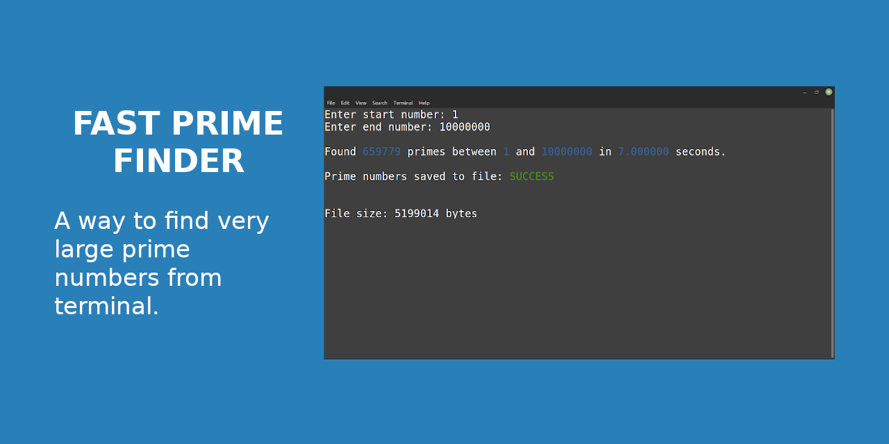

# Fast Prime Finder

Prime numbers are numbers that are only divisible by 1 and itself. For example, 2, 3, 5, 7... But what about the number 132598717? It can be difficult to tell whether large numbers like this are prime or not. We may even need to check many big numbers like this (someday, who knows). That's why this program finds all prime numbers in a range given a start and end value VERY QUICKLY.

## Tech Specs of the Above Example

- Intel® Core™ i5-2400 × 4
- Linux Mint 20.3 Cinnamon
- GNU C Compiler
- GNOME Terminal

## How Does It Work?

The program makes use of practical ways to check if a number is prime.

For more information see the [details](https://byjus.com/maths/how-to-find-prime-numbers/).

## Compile & Run Program

Compile the executable in the 'bin' folder with the 'compile' command in the Makefile.

```bash
make compile
```

Run it...

```bash
make run
```

Enter the start number and end number on the screen that comes up. All prime numbers in the range you specify will be found and saved to the file.

## Why This Program?

Dunno.
